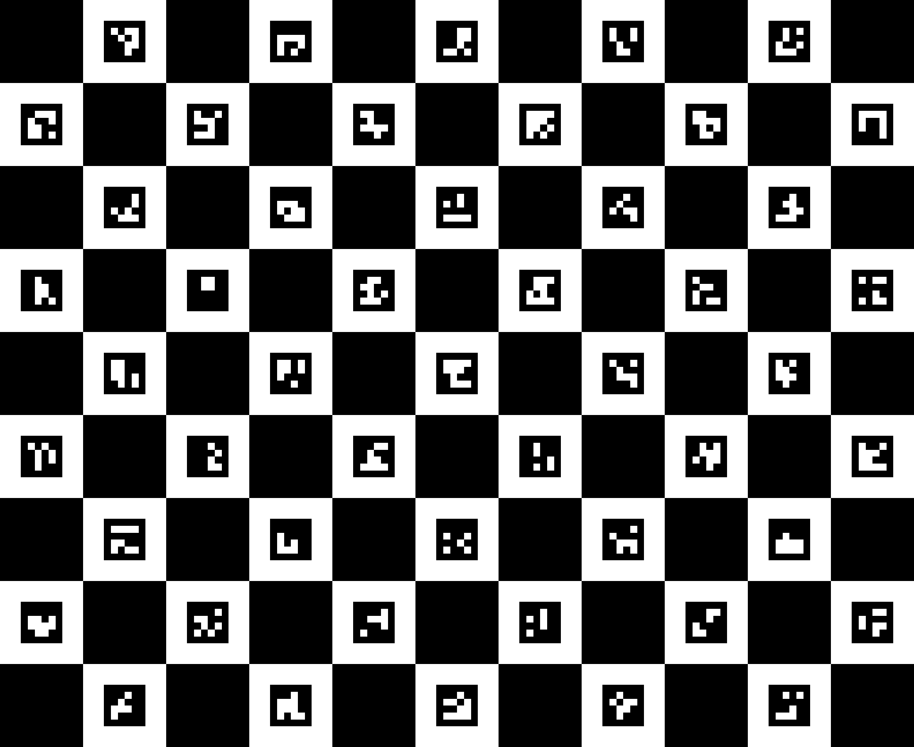

Introduce to ROS
===

- [Introduce to ROS](#introduce-to-ros)
  - [Simulate a Denso robot in ROS environment](#simulate-a-denso-robot-in-ros-environment)
    - [Install ROS and package](#install-ros-and-package)
    - [Pull Denso model from github](#pull-denso-model-from-github)
  - [Motion planning with MoveIt framework](#motion-planning-with-moveit-framework)
  - [Add a pattern object to Gazebo](#add-a-pattern-object-to-gazebo)
  - [Contorl real Denso robot](#contorl-real-denso-robot)
    - [With Teaching Pendant](#with-teaching-pendant)
    - [With Wincap III](#with-wincap-iii)
    - [With C Sharp](#with-c-harp)
    - [With ROS](#with-ros)

Simulate a Denso robot in ROS environment 
---
### Install ROS and package
- OS requirement: Ubuntu 16.04 LTS. 
- Make sure your python2 enviroment up to date, check the version by run the following command in terminal
    ```
    python2 --version
    pip2 --version
    ```
    Update your python2:
    ```
    sudo apt-get update
    sudo apt-get install -y python
    sudo apt-get install -y python-pip
    sudo pip2 install --upgrade pip
    ```
- Install ROS Kinetic  and MoveIt package, save the content to the file `install_ros.sh`, and run `bash install_ros.sh` in terminal.

    ```
    #!/bin/bash

    sudo sh -c 'echo "deb http://packages.ros.org/ros/ubuntu $(lsb_release -sc) main" > /etc/apt/sources.list.d/ros-latest.list'
    sudo apt-get update
    sudo apt-get install -y --allow-unauthenticated ros-kinetic-desktop-full
    apt-cache search ros-kinetic

    echo "" >> ~/.bashrc
    echo "# ROS" >> ~/.bashrc
    echo "export EDITOR='code'" >> ~/.bashrc
    echo "source /opt/ros/kinetic/setup.bash" >> ~/.bashrc
    source ~/.bashrc

    sudo rosdep init
    rosdep update

    sudo apt-get install -y --allow-unauthenticated ros-kinetic-moveit
    sudo apt-get install -y --allow-unauthenticated ros-kinetic-denso-robot-ros

    source /opt/ros/kinetic/setup.bash

    sudo mkdir -p /data/denso_ws/src/ros_home/img
    sudo chown -R $USER:$USER /data
    cd /data/denso_ws/
    catkin_make
    echo "source /data/denso_ws/devel/setup.bash" >> ~/.bashrc
    echo "export ROS_HOME=/data/denso_ws/src/ros_home" >> ~/.bashrc

    source ~/.bashrc
    ```


### Pull Denso model from github
- Close termial and restart it
- Now we need to remove the original denso model and pull the new one from github
    ```
    cd /opt/ros/kinetic/share    # Change to ROS directory
    ls denso*                    # list all package of denso
    sudo cp -rf denso* ~/Desktop # Backup to Desktop
    sudo rm -rf denso*           # Delete them!
    ```
- Check is there a directory in the path `/data/denso_ws`. if not, run those command to build a catkin workspace
    ```
    sudo mkdir -p /data/denso_ws/src/ros_home/img
    sudo chown -R $USER:$USER /data
    cd /data/denso_ws/
    catkin_make
    echo "source /data/denso_ws/devel/setup.bash" >> ~/.bashrc
    echo "export ROS_HOME=/data/denso_ws/src/ros_home" >> ~/.bashrc
    ```
- Pull the Denso ROS model by running:
    ```
    cd /data/denso_ws/src
    sudo apt-get install -y git
    git clone https://github.com/solab-ntu/denso_robot_ros.git
    ```
- Test it
    ```
    roslaunch denso_robot_bringup vs060_bringup.launch
    ```


Motion planning with MoveIt framework
---
There are three interface to control robot with [MoveIt](http://docs.ros.org/kinetic/api/moveit_tutorials/html/doc/move_group_interface/move_group_interface_tutorial.html):
1. **Rivz GUI**
   Launch Denso vs060 robot, and you should open Gazebo and Rviz window
   ```
   roslaunch denso_robot_bringup vs060_bringup.launch
   ```
   There is a [moveit GUI plugin](http://docs.ros.org/kinetic/api/moveit_tutorials/html/doc/quickstart_in_rviz/quickstart_in_rviz_tutorial.html) in Rviz interface, just drag the end effector and excute robot as shown in the GIF


1. **Commander Scripting**
    Use shell-like command interact with robot, first run the command in the new terminal windows,
   ```
   roslaunch moveit_cmdline_commander moveit_cmdline_commander.launch
   ```
    
    The command below will start a command line interface tool that allows you to connect to a running instance of the move_group node. The first command you should type is:
    ```
    use arm
    ```
    
    This will connect to the move_group node for the group name you specified (in the Denso, for instance, you could connect to arm). You can now execute commands on that group. This command, current, will show you the current state of your group:
    ```
    current
    ```
    
    To record that state under a specific name you can simply type:
    ```
    rec goal
    ```
    
    This will remember the current joint values of the robot group under the name `goal`. Matlab-like syntax is available for modifying joint values. We then modify the first joint of goal to 0.2. You may need to use a different value instead of 0.2 (it needs to be within your allowed bounds and not cause collisions). The go command plans a motion and executes it.

    To get the robot to move, you could type, for example:
    ```
    goal[0] = 0.2
    go goal
    ```
    
    Instead of calling go you could also type:
    ```
    goal[0] = 0.2
    goal[1] = 0.2
    plan goal
    execute
    ```
    
    This is slightly inefficient, but the advantage is that the plan command allows you to visualize the computed motion plan in RViz before you actually issue the execute command.

    For a list of supported commands, you can type `help`. To exit the moveit_commander interface you can type `quit`.

2. **Python interface**

   Run the command in the new terminal windows,
   ```
   roslaunch moveit_python_commander moveit_python_commander.launch
   ```
    In RViz, we should be able to see the following:

    Press <enter> in the shell terminal where you ran the command in between each step
    
    1. The robot plans and moves its arm to the joint goal.
    2. The robot plans a path to a pose goal.
    3. The robot plans a Cartesian path.
    4. The robot executes the Cartesian path plan.


Add a pattern object to Gazebo
---
1. Generate pattern texture from VISIO or OpenCV. Here is a example 
   



1. Build pattern object(*.dae) with Blender 
    Install Blender from [website](https://builder.blender.org/download/) and here is [tutorial](
    https://www.youtube.com/watch?v=POWq9aeDLls)

    Finally, you should generate a pattern object in *.dae format, now we should add this object to the Denso Gazebo urdf model. (Make sure there is pattern.dae file and pattern.png texture in denso_robot_descriptions folder)
    ```
    # vs060.urdf locate in denso_robot_descriptions/vs060_description

    <robot name="vs060">
    ... vs060 robot description ...

    <!-- Pattern -->
    <link name="pattern">
        <visual>
            <origin rpy="0 0 0" xyz="0 0 0" />
            <geometry>
                <mesh filename="package://denso_robot_descriptions/vs060_description/pattern.dae" scale="1 1 1" />
            </geometry>
        </visual>
        <collision>
            <origin rpy="0 0 0" xyz="0 0 0" />
            <geometry>
                <box size="0.22 0.18 0.002"/> 
            </geometry>
        </collision>
        <inertial>
            <mass value="1" />
            <origin rpy="0.000000 0.000000 0.000000" xyz="0.000000 0.000000 0.000000" />
            <inertia ixx="1" ixy="0" ixz="0" iyy="1" iyz="0" izz="1" />
        </inertial>
    </link>

    <joint name="joint_pattern" type="fixed">
        <parent link="world" />
        <child link="pattern" />
        <origin rpy="0.000000 0.000000 1.5707963" xyz="0.300000 0.000000 0.001" />
    </joint>

    <!-- Add emissive light in pattern self -->
    <gazebo reference="pattern">
        <visual>
            <material>
                <emissive>0.5 0.5 0.5 0.5</emissive>
                <shader type='vertex'>
                    <normal_map>__default__</normal_map>
                </shader>
            </material>
        </visual>
    </gazebo>
    </robot>
    ```

Contorl real Denso robot 
---
### With Teaching Pendant
Basic operation

### With Wincap III
1. Connect PC and RC8 control with ethernet cable. Then, change local IP in same LAN Network with RC8, `192.168.0.2` for example. Programming [tutorial](https://www.youtube.com/watch?v=MAyrm8Ra5kw):


### With C-Sharp
1. Install ORiN2 SDK and Visual Studio
2. Clone the C-Sharp sample code from [here](https://github.com/solab-ntu/denso_robot_cs)

### With ROS
1. Setting up the bCap server in Denso robot, please see [here](http://wiki.ros.org/denso_robot_ros/Tutorials/How%20to%20control%20an%20RC8%20with%20MoveIt%21).
2. Generate URDF model for VP6242 and an associated MoveIt configuration package as a standard component, please see [here](http://wiki.ros.org/denso_robot_ros/ROSConverter)
3. Connect your linux computer and RC8 control with ethernet cable. Then, change local IP in same LAN Network with RC8, `192.168.0.2` for example. Control robot by MoveIt framework, simply run
    ```
    roslaunch denso_robot_bringup vs6242_bringup.launch sim:=false ip_address:=192.168.0.1
    ```
